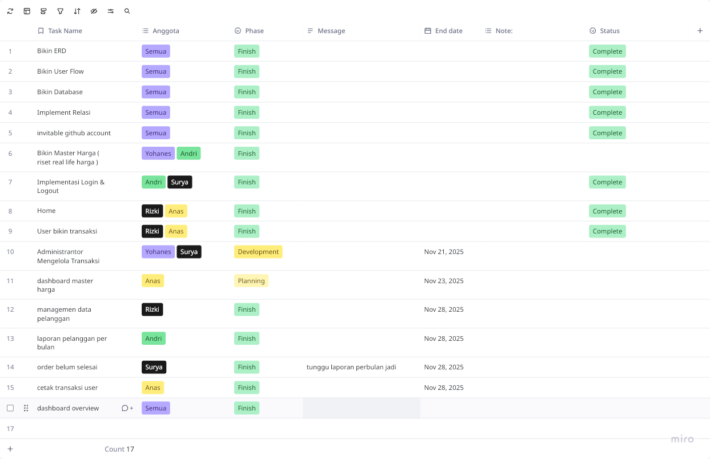

# FRESH LOANDRY
> Laundry Online yang bertujuan untuk mempermudah proses pemesanan, pelacakan status, hingga pencatatan transaksi secara digital. Dengan diterapkannya sistem ini, kami berharap layanan laundry dapat menjadi lebih cepat, teratur, transparan, dan nyaman digunakan oleh semua pihak.

### TEAMS & CONTRIBUTOR
- [Yohanes Oktanio](https://github.com/yohanesokta) | 240411100095
- [Surya Maulana Akhmad](https://github.com/suryamaulana98) | 240411100160
- [Rizki Pratama Sunarko](https://github.com/rizkisunarko) | 240411100181
- [Anas](https://github.com/Anasasemjaran) | 240411100200
- [M Andri Firmansyah](https://github.com/Andri-24) | 240411100139

### CONTRIBUTING TASK

#### PROJECT TREE
```
ROOT
├─ .github
│  └─ workflows
│     └─ main.yml
├─ .gitignore
├─ .htaccess
├─ Dockerfile
├─ LICENSE.txt
├─ README.md
├─ config
│  ├─ koneksi.php
│  └─ nginx.conf
├─ controllers
│  ├─ adminController.php
│  ├─ authController.php
│  ├─ main_controller.php
│  └─ userController.php
├─ database.sql
├─ docker-compose.yml
├─ index.php
├─ lib
│  ├─ controllers.php
│  ├─ loader.php
│  ├─ middleware.php
│  └─ routes.php
├─ models
│  ├─ admin_models.php
│  ├─ pesanan_models.php
│  └─ user_models.php
├─ public
│  ├─ .gitkeep
│  ├─ Service_laudry.jpeg
│  ├─ blank-profile.webp
│  ├─ css
│  │  ├─ 404.css
│  │  ├─ admin-pelanggan.css
│  │  ├─ admin.css
│  │  ├─ home.css
│  │  ├─ pesanan.css
│  │  ├─ print.css
│  │  ├─ profile.css
│  │  └─ update_profile.css
│  ├─ gambar1.jpeg
│  ├─ service.png
│  ├─ service1.png
│  └─ tes.png
├─ routes
│  └─ routes.php
└─ views
   ├─ 404.php
   ├─ admin
   │  ├─ components
   │  │  ├─ footer.php
   │  │  ├─ header.php
   │  │  └─ sidebar.php
   │  ├─ dashboard.php
   │  ├─ harga.php
   │  ├─ laporan.php
   │  ├─ masterharga.php
   │  ├─ pelanggan.php
   │  └─ pesanan.php
   ├─ auth
   │  ├─ login.php
   │  ├─ register.php
   │  └─ user-profile.php
   ├─ dashboard_user.php
   ├─ footer.php
   ├─ header.php
   ├─ home.php
   ├─ main.php
   └─ update_profile.php
```
# PASCA RUNNING

>  hal yang wajib di lakukan untuk bisa menjalankan adalah pastikan web server kalian mendukung mod_rewrite. Hal ini umum dilakukan di production ready aplikasi. ini bukan plugin tapi fitur apache yang harus di aktifkan, syukurlah kalo misal pake nginx tinggal config 

**Cara Mengaktifkan Mod Rewrite**

1. Buka httpd.conf ( xampp biasa di C:\xampp\apache\conf\httpd.conf )
2. cari bagian
```
#LoadModule rewrite_module modules/mod_rewrite.so
```
hapus tanda pagar , pastikan tidak ada tanda pagar untuk itu!

2. cari semua bagian AllowOverride pastikan all tidak denide atau yang lain
3. cari semua Require all pastikan granted 

atau lihat di tutorial jaman batu [disini](https://www.youtube.com/watch?v=OCDPTTuvAZ4)

# CARA RUNNING


1. clone proyek ke htdocs webserver ( wajib di htdocs gk usa move move )
```bash
git clone https://github.com/yohanesokta/paw_studycase.git
```
2. setup database import di [database.sql](./database.sql)
3. buka via localhost webserver.

## DEPLOY ( OPTIONAL )

Docker with docker compose

```bash
git clone https://github.com/yohanesokta/paw_studycase.git
cp .env.example .env
docker compose up -d
```